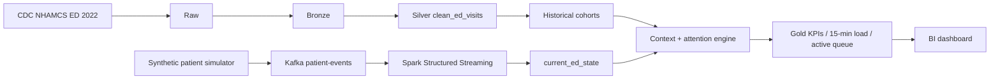

# Smart Emergency Room

A production-style Data Engineering project combining public historical
emergency-department data with a simulated live patient-event stream. It builds
a continuously updated operational ED view, historical wait context and
explainable attention indicators for BI.

> This is an educational operational analytics system—not a diagnostic tool,
> validated clinical decision-support system, or replacement for medical triage.

## Business problem

Emergency departments need a current view of load and waiting patients, plus
context for whether a wait is unusual for similar historical visits. This
platform demonstrates batch and streaming ingestion, medallion modeling,
event-time processing, state, data quality, historical matching and BI-ready
outputs without exposing real-time patient data.

## Architecture



See [architecture.md](docs/architecture.md) for design details.

## Historical source and layers

The historical source is the official public-use [CDC NHAMCS Emergency
Department 2022 dataset](https://www.cdc.gov/nchs/nhamcs/documentation/index.html).
The downloader retrieves the 1.7MB ZIP from CDC and verifies its SHA-256.

- Raw: untouched CDC ZIP/fixed-width file under `data/raw/nhamcs/2022/`.
- Bronze: complete raw records plus filename, row number, source and ingestion time.
- Silver: source-independent `clean_ed_visits`, quality flags included.
- Cohorts: triage/age/hour aggregates with documented fallbacks.
- Gold: active state, operational KPIs and 15-minute event-time load.

NHAMCS public data contains no stable patient identifier or exact visit date.
Those fields remain NULL; the pipeline never invents clinical facts. Full
mapping is in [source_to_target.md](docs/source_to_target.md).

## Streaming pipeline

The simulator produces versioned synthetic ARRIVAL, TRIAGE, VITALS_UPDATE,
STATUS_UPDATE, ADMISSION and DISCHARGE events. Kafka carries the
`patient-events` topic. Spark applies an explicit schema, event timestamps, a
watermark, event-ID deduplication and malformed-event quarantine. Stateful
updates maintain one row per active visit; terminal events remove visits.

The Context Engine matches each active visit using this hierarchy:

```text
triage + age group + arrival hour
  -> triage + age group
  -> triage
  -> overall
```

Attention is a transparent operational rule score based on wait deviation,
triage severity, synthetic vital flags, update staleness and ED load. Reasons
are stored on every row.

## Quick start

Prerequisites: Python 3.11+, Docker Desktop with Compose, and internet access for
the first CDC/image download.

```bash
git clone https://github.com/shachar-datalabs/Smart_Emergency_Room.git
cd Smart_Emergency_Room
cp .env.example .env
python -m pip install -r requirements.txt
python scripts/download_data.py
python scripts/run_historical_pipeline.py
python scripts/run_end_to_end_demo.py
```

The last command runs the entire no-broker deterministic smoke flow and writes
Gold results under `data/gold/`.

## Kafka + Spark demo

```bash
docker compose up -d
python scripts/run_streaming_pipeline.py --seconds 60
```

While Spark is running, publish events in another terminal:

```bash
python -m src.simulator.patient_simulator \
  --patients 12 --seed 42 --rate 20 --kafka
```

Inspect `data/streaming/current_ed_state.jsonl` and
`data/streaming/dq_streaming.json`, then stop local services:

```bash
docker compose down
```

## Tests

```bash
python -m unittest discover -s tests -v
python -m unittest discover -s batch/tests -p "test*.py" -v
python scripts/test_phase0.py
docker compose config --quiet
```

Tests cover canonical schemas, missing values, invalid vitals, deterministic
mapping/simulation, cohorts, duplicates, out-of-order and late events,
malformed/missing events, state transitions, context fallbacks and Gold outputs.

## Data quality and observability

Historical and streaming DQ reports are machine-readable JSON. Invalid source
records are retained with flags; invalid events are quarantined. Components emit
structured JSON logs with timestamps, component/event names and record counts.
See [data_quality.md](docs/data_quality.md).

## GCP-ready mapping and zero-cost status

| Local | GCP-ready target |
|---|---|
| `data/raw/nhamcs/2022/` | `gs://<bucket>/raw/nhamcs/2022/` |
| Bronze JSONL | `smart_er_bronze.nhamcs_ed_raw` |
| Silver JSONL | `smart_er_silver.clean_ed_visits` |
| Cohorts JSONL | `smart_er_silver.historical_cohorts` |
| Gold JSON/JSONL | `smart_er_gold.current_ed_state`, `ed_kpis`, `ed_load_15min` |

BigQuery-compatible partitioned/clustered DDL lives under `sql/`. It was not
executed. No NHAMCS data was uploaded and no potentially billable GCP query or
resource was intentionally run during Phases 1–4. Existing Phase 0 bucket and
empty datasets remain unchanged.

## Demo outputs

- `data/bronze/nhamcs_ed_raw.jsonl`
- `data/silver/clean_ed_visits.jsonl`
- `data/silver/historical_cohorts.jsonl`
- `data/gold/current_ed_state.jsonl`
- `data/gold/ed_kpis.json`
- `data/gold/ed_load_15min.jsonl`
- `data/gold/dq_historical.json`
- `data/gold/dq_streaming.json`
- `data/gold/e2e_evidence.json`

The dashboard contract is in
[smart_er_dashboard.md](dashboards/smart_er_dashboard.md). A future production
deployment can replace local outputs with GCS/BigQuery sinks and connect Looker
Studio, while retaining the same source adapter, event and Gold contracts.

The presentation-ready Looker handoff is generated with:

```bash
python scripts/export_looker_data.py
node scripts/build_looker_workbook.mjs
```

This writes five CSV files plus
`exports/looker/Smart_Emergency_Room_Looker_Source.xlsx`. Dashboard layout,
field aggregations, and Android setup are documented in
`docs/looker_studio_dashboard.md`, `docs/looker_field_dictionary.md`, and
`docs/LOOKER_PHONE_SETUP.md`.
