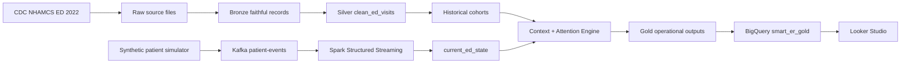

# Architecture

Smart Emergency Room combines a real historical emergency-department dataset with a synthetic real-time event stream. Historical processing provides context, while Kafka and Spark maintain the current operational ED state. The resulting Gold outputs are synchronized to BigQuery and exposed to Looker Studio for BI.

> Historical data is real public-use CDC NHAMCS data. Real-time patient events are synthetic and generated only for demonstration. The attention score is operational and explainable, not validated clinical decision support.

## End-to-end architecture



## Historical path

```text
CDC NHAMCS ED 2022
        |
        v
       Raw
        |
        v
      Bronze
        |
        v
Silver clean_ed_visits
        |
        v
 Historical cohorts
        |
        v
 Context Engine
```

The historical source is the official CDC NHAMCS Emergency Department 2022 public-use dataset. `src/sources/nhamcs` owns the source-specific fixed-width parsing and maps records into the canonical ED visit model consumed downstream.

The separation between the source adapter and the canonical Silver contract allows another approved ED source to be added later without redesigning cohorts, streaming, context, or Gold logic.

## Real-time path

```text
Synthetic Patient Simulator
           |
           v
 Kafka patient-events
           |
           v
Spark Structured Streaming
           |
           v
   current_ed_state
           |
           v
 Context + Attention Engine
```

The simulator emits versioned synthetic events including ARRIVAL, TRIAGE, VITALS_UPDATE, STATUS_UPDATE, ADMISSION and DISCHARGE.

Kafka transports the events. Spark Structured Streaming applies an explicit event schema, event-time processing, watermarking, event-ID deduplication, malformed-event quarantine and stateful updates. The state layer keeps one logical current row per active ED visit.

## Historical + live context

The Context Engine combines the current synthetic visit state with historical CDC cohorts. Matching follows the documented fallback hierarchy:

```text
triage + age group + arrival hour
  -> triage + age group
  -> triage
  -> overall
```

This allows the platform to compare current operational behavior with historical patterns without claiming clinical diagnosis or prediction.

The Attention Engine creates an explainable operational score using factors such as wait deviation, triage severity, synthetic vital-sign flags, update staleness and current ED load. Each output row stores the reason for the score.

## Gold and BI path

```text
Context Engine
      |
      v
     Gold
      |
      +-- current_ed_state / active_patients
      +-- ed_kpis
      +-- ed_load_15min
      +-- historical/context outputs
      +-- data-quality outputs
      |
      v
BigQuery
shachar-bigquery-lab.smart_er_gold
      |
      v
Looker Studio
```

The project produces Gold outputs locally first. The synchronization scripts then load the BI-ready outputs into the existing BigQuery dataset `shachar-bigquery-lab.smart_er_gold` using small idempotent replace load jobs.

Looker Studio uses the BigQuery Gold tables as its primary BI source. A Google Sheets/XLSX export package remains available as a presentation backup.

## Local and GCP responsibilities

The computational streaming path currently runs locally:

- Docker Compose
- Kafka in KRaft mode
- Spark Structured Streaming
- durable Spark checkpoints
- atomic local output files

GCP is used only for the BI-ready Gold serving layer in the current implementation:

- existing BigQuery project: `shachar-bigquery-lab`
- existing Gold dataset: `smart_er_gold`
- Looker Studio as the BI presentation layer

The project does not provision VM, Dataproc, Dataflow, GKE, Pub/Sub, scheduled queries, continuous queries, or a managed cloud streaming service.

## Layer contracts

```text
Raw
  -> untouched source files

Bronze
  -> faithful source records + ingestion metadata

Silver
  -> canonical clean_ed_visits + quality flags

Historical Cohorts
  -> reusable historical context aggregates

Streaming State
  -> current active ED visits

Gold
  -> BI-ready operational KPIs, load windows, active queue and context

BigQuery
  -> serving layer for Looker Studio
```

## Production evolution

A future production deployment could move Raw storage to GCS and replace local streaming components with managed cloud equivalents while preserving the current source, event, Silver and Gold contracts. The present implementation intentionally keeps streaming compute local and uses only the existing BigQuery serving layer for the demo architecture.
