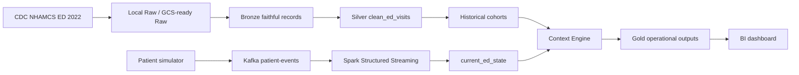

# Architecture

Historical processing is source-adapter based. `src/sources/nhamcs` owns the
CDC fixed-width format; downstream code receives a canonical ED visit model.
A future `src/sources/mimic` adapter can produce the same model without changing
cohort, context, streaming, or Gold logic.

The local implementation uses immutable downloaded source files, JSONL layer
contracts, Kafka in KRaft mode, Spark Structured Streaming, durable Spark
checkpoints, and atomic local file writes. BigQuery-compatible DDL is prepared
but not executed because cloud work might incur charges.
